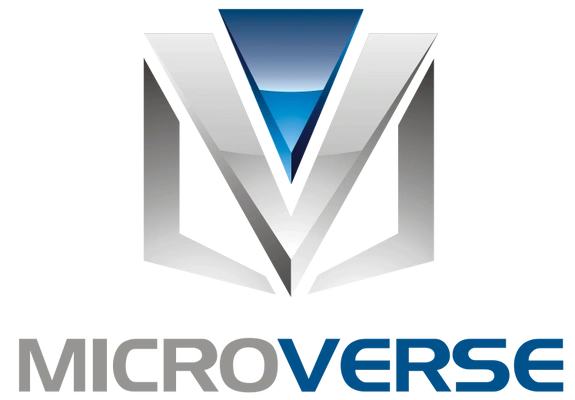

  
   
  <h3><b>Microverse README Template</b></h3>

# 📗 Table of Contents

- [📖 About the project](#about-project)
  - [🛠 Built With](#built-with)
    - [Tech Stack](#tech-stack)
    - [Key Features](#key-features)
  - [🚀 Live Demo](#live-demo)
- [💻 Getting Started](#getting-started)
  - [Setup](#setup)
  - [Prerequisites](#prerequisites)
  - [Install](#install)
  - [Usage](#usage)
  - [Run tests](#run-tests)
  - [Deployment](#triangular_flag_on_post-deployment)
- [👥 Authors](#authors)
- [🔭 Future Features](#future-features)
- [🤝 Contributing](#contributing)
- [⭐️ Show your support](#support)
- [🙏 Acknowledgements](#acknowledgements)
- [❓ FAQ (OPTIONAL)](#faq)
- [📝 License](#license)

# 📖 [Hello Microverse Project] 

**[Hello Microverse Project]** is a Hello Microverse git hub repository without any complex coding set up with proper linter of HTML and CSS which also includes new branch that is created in accordance with the GitHub flow rules in order to make code concise,correct and standardised.

## 🛠 Built With 

### Tech Stack 

### Key Features 

- **[Error-Free]**
- **[Centralized]**
- **[Standardised]**

(<a href="#readme-top">back to top</a>)

## 🚀 Live Demo 

- [Live Demo Link](https://yourdeployedapplicationlink.com)

(<a href="#readme-top">back to top</a>)

## 💻 Getting Started 

>A linter is a tool that checks your code for errors and provides suggestions for how to improve your code. By using a linter, you can identify and fix issues before they become larger problems.

You can configure a linter to check multiple files in your project, which is especially helpful when working on larger projects with many files. You can also use the configuration file of your linter as a blueprint for your project's coding conventions finally improving the overall quality of your code and making your development process more efficient.

To get a local copy up and running, follow these steps.

### Prerequisites

In order to run this project you need:

1.Github account 
2.Text Editor 
3.Web Browser

### Setup

Clone this repository to your desired folder:

### Usage

To run the project, execute the following file: index.html

### Run tests

To run tests, run the following command:
To run tests, run the following command: Open the code in Visual Studio Code and run the following commands :

npx hint . npx stylelint "**/*.{css,scss}"

### Deployment

You can deploy this project using: github, VS Code

(<a href="#readme-top">back to top</a>)

## 👥 Author 

👤 **Vivek Raj**

- GitHub: [@githubhandle](https://github.com/VivekRaaZ?tab=repositories)
- Twitter: [@twitterhandle](https://twitter.com/BossVivekRaj)
- LinkedIn: [LinkedIn](https://www.linkedin.com/in/vivek-raj-a78b92256/)

(<a href="#readme-top">back to top</a>)

## 🔭 Future Features 

- [ ] **[Improving the outlook by implementing the responsive design]**
- [ ] **[Styling the heading by using CSS]**

(<a href="#readme-top">back to top</a>)

## 🤝 Contributing 

Contributions, issues, and feature requests are welcome!

(<a href="#readme-top">back to top</a>)

## ⭐️ Show your support 

> The beginning is always difficult, and once the flow begins, then no one can stop it. So do support this first step towards excellence.

(<a href="#readme-top">back to top</a>)

## 🙏 Acknowledgments 

> I would like to thanks microverse team, github team and my coding partners, who contributed towards the completion of this task.

(<a href="#readme-top">back to top</a>)

## 📝 License 

This project is copyright of [Vivek Raj]

_NOTE: we recommend using the [MIT license](https://choosealicense.com/licenses/mit/) - you can set it up quickly by [using templates available on GitHub](https://docs.github.com/en/communities/setting-up-your-project-for-healthy-contributions/adding-a-license-to-a-repository). You can also use [any other license](https://choosealicense.com/licenses/) if you wish._

(<a href="#readme-top">back to top</a>)

